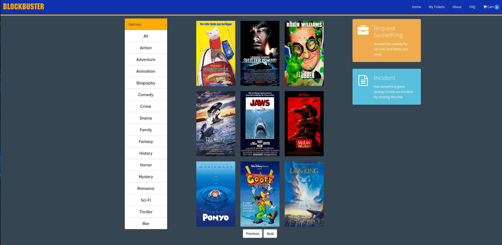
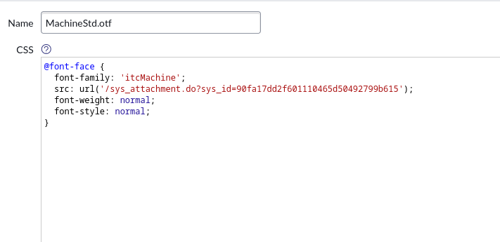
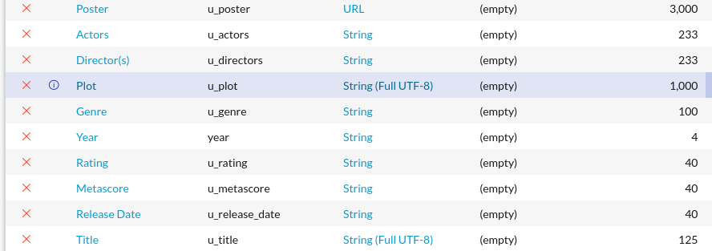
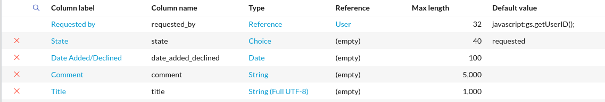
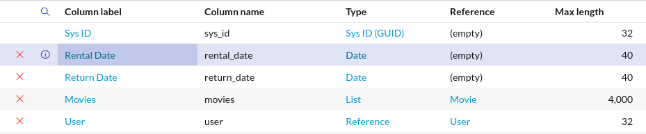

# BlockBuster

&nbsp; BlockBuster is a servicenow scoped application. It includes three unique tables to keep track of movies, rental history, and movie requests. It also comes with 3 custom widgets for the serivce portal.

## Service Portal Font
Upon installation the font in the service portal will be missing in order to reinstall it  
navigate to <code> All > Service Portal > CSS > MachineStd.otf </code> add MachineStd.otf  
from the assets from the github repo as an attachment save and then find the attachment  
in the sys_attachment table and copy its <code>sys_id</code> and replace the sys_id in  
the src line in MachineStd CSS file.  

## Movie table Fields (x_809069_bbuster_u_cmdb_ci_movie)

## Movie Request table Fields (x_809069_bbuster_movie_requests)

## Movie Rental History table Fields (x_809069_bbuster_rental_history)
