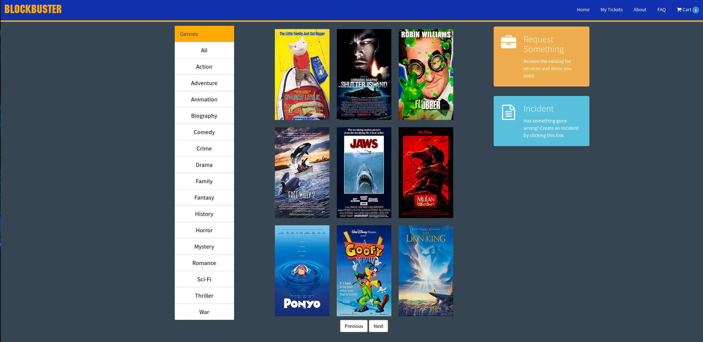
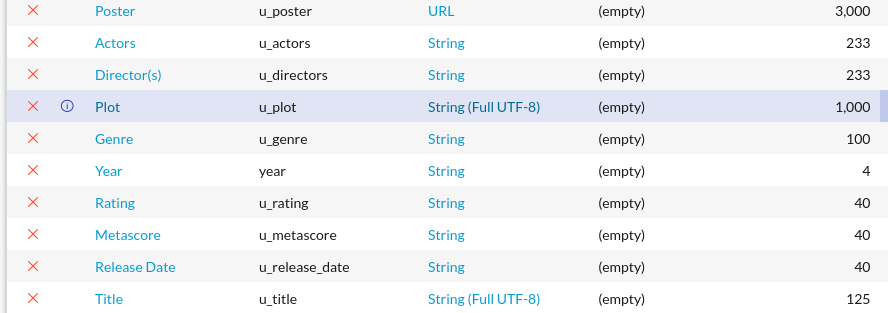
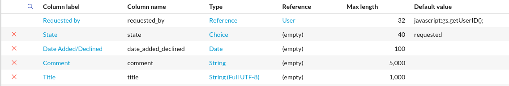

# BlockBuster

&nbsp; BlockBuster is a servicenow scoped application. It includes three unique tables to keep track of movies, rental history, and movie requests. It also comes with 3 custom widgets for the serivce portal.

## Movie table Fields (x_809069_bbuster_u_cmdb_ci_movie)

## Movie Request table Fields (x_809069_bbuster_movie_requests)

## Movie Rental History table Fields (x_809069_bbuster_rental_history)
